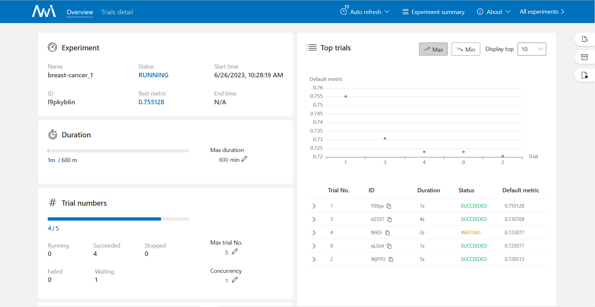

# Tabular Incrml

## Incremental Machine Learning on Tabular Data(Tabular Incrml)

Tabular Incrml can do fully automate machine learning tasks and perform continuous learning on real-time data, enabling you to easily achieve powerful predictive performance in real production environments. Only one command line to obtain a high-precision model, and then one command to run a model as a RESTful service. It's also a framework for various AutoFE, AutoML, DataEnhancement, IncrementalLearning and other algorithms. Now we are opening dfs-based autofe algorithm, inspired by this project(https://github.com/SpongebBob/tabular_automl_NNI), and we will open source more algorithms and features in the near future. If you are interesting in full-feature project, you're welcomed to contant us(Jiangsu YiSiChangTian Digital Intellgence Techonology Co.Ltd, ysct_official@126.com)

## Example

```python
# First install package from terminal:
# pip install -r requirements.txt

# bash run.sh [your_data_path] [label_column_name]
bash run.sh example/classification/breast-cancer.data Class
```

Currently dataset has to be csv formatted file.

## Output

#### Using the NNI for hyperparameter tuning

```shell
# output in terminel
(conda) ➜  tabular_incrml bash run.sh example/classification/breast-cancer.data Class
increamental learning started
File change detected, start incremental learning experiment
[2023-06-26 02:28:17] Creating experiment, Experiment ID: l9pkyb6n
[2023-06-26 02:28:17] Starting web server...
[2023-06-26 02:28:19] Setting up...
[2023-06-26 02:28:20] Web portal URLs: http://127.0.0.1:8086 http://192.168.110.109:8086 http://172.17.0.1:8086
```

#### You can view the trial's results on NNI web portal URLs



#### Wait a mininute, The terminal will output the optimal advanced feature

The results will be saved in the results directory.

```shell
original precision:0.7230769230769231
autofe experiment 1 is over , get advanced features: ['crosscount|||degmalig|||irradiat', 'crosscount|||breastquad|||tumorsize', 'crosscount|||menopause|||tumorsize', 'nunique|||invnodes|||degmalig', 'crosscount|||age|||breastquad', 'crosscount|||irradiat|||nodecaps', 'crosscount|||breastquad|||invnodes', 'crosscount|||degmalig|||invnodes', 'crosscount|||breastquad|||degmalig', 'crosscount|||irradiat|||tumorsize']
[2023-06-26 02:29:30] Stopping experiment, please wait...
[2023-06-26 02:29:30] Experiment stopped
```

#### You can also edit the yaml file to match your needs

```yaml
AuthorName: someone 
AutoFE:
  Method: DFS # autoFE algorithm(Currently we have dfs)
  SaveFeatures: OnlyGreater # save features way
  maxTrialNum: 5 # the max trial num
  port: 8086 
DataSource:
  dir: benchmark/breast-cancer/data
  type: local_dir
Feature:
  CategoricalFeature: 
  # category feature name, should check
  - age
  - menopause
  - tumorsize
  - invnodes
  - nodecaps
  - degmalig
  - breast
  - breastquad
  - irradiat
  FeatureName:
  # all feature name
  - age
  - menopause
  - tumorsize
  - invnodes
  - nodecaps
  - degmalig
  - breast
  - breastquad
  - irradiat
  Metric: roc_auc # choose feature metric
  TargetName: Class # label feature name
  TaskType: classification 
IncrML: # we will opensource more features later
  Method: iCaRL
  Trigger: OnDataFileIncrease
Resource:
  trainingServicePlatform: local
TaskName: breast-cancer
```

